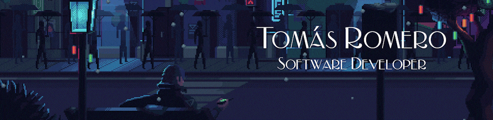

Estudiante avanzado de la **Tecnicatura Universitaria en Programación (UTN FRA)**, con formación en **desarrollo Full Stack** utilizando tecnologías como **React, Angular y Node.js**.  

### Lenguajes

   
     
  
  

### Frameworks y Bibliotecas

### Bases de Datos

 

### 
 

## 📫 Contáctame  

¡Si estás interesado en colaborar en algún proyecto no dudes en ponerte en contacto conmigo!  

  
  

